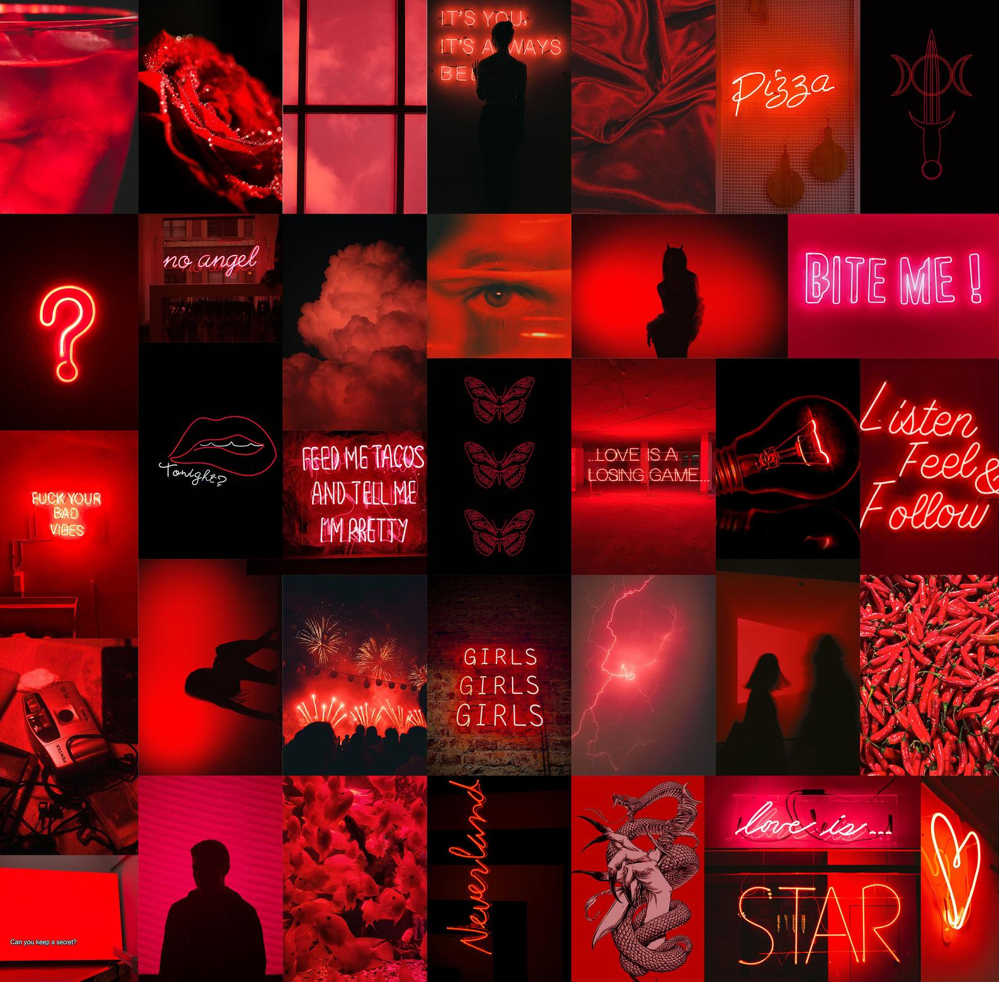

# Collage Repository
Shopify Challenge 

There has been a recent trend of pictures collages as wall decorations, where the various pictures in each collage would correpsond to one colour. Here is an example of some of these collages:

The collages that are made out there are handpicked images, but I was interested in creating an image repository that automatically generated a collage once you chose the colour you wanted. 

For example, if you input the colour "orange" into my code, it will search my image repository for all the images that are mostly orange, and then it will stitch those images together to create a collage
